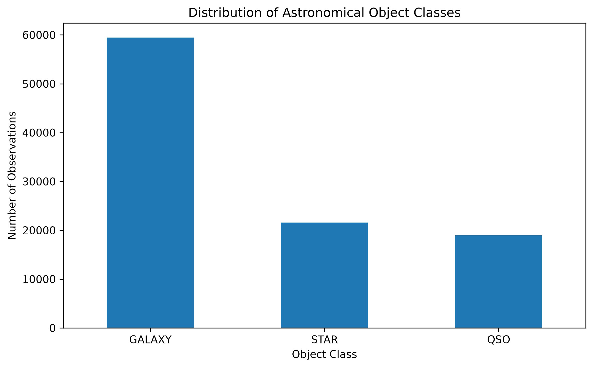
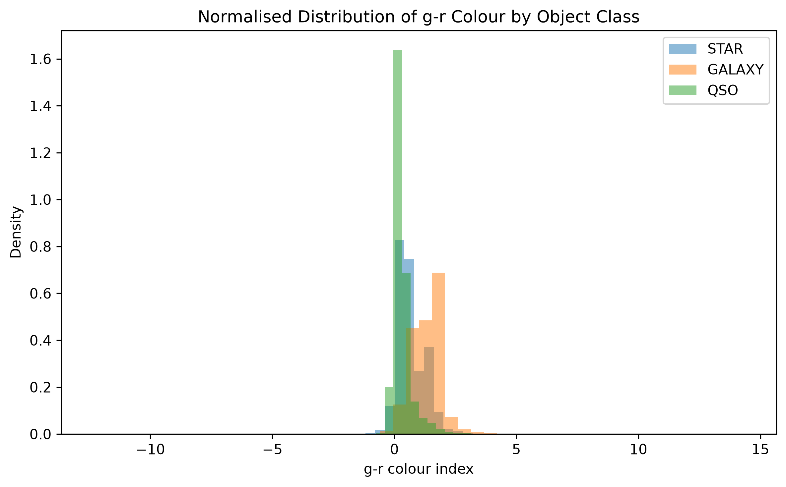
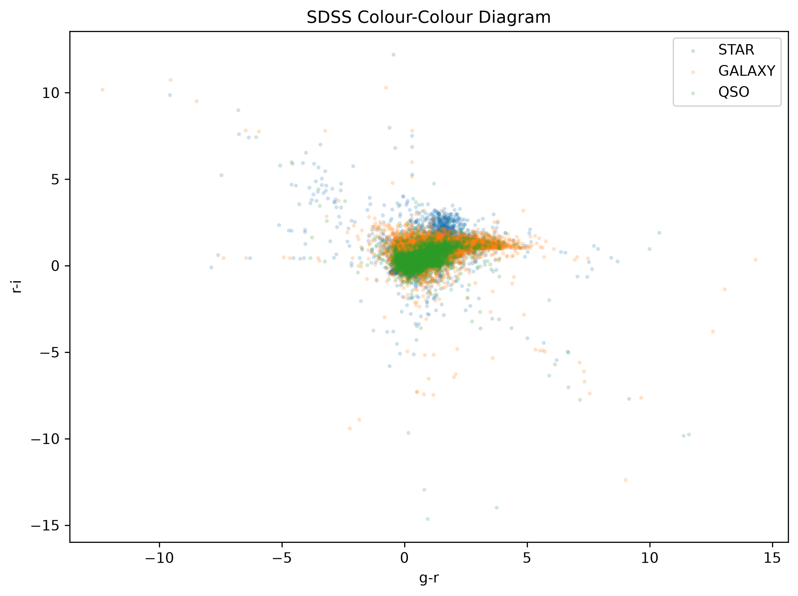
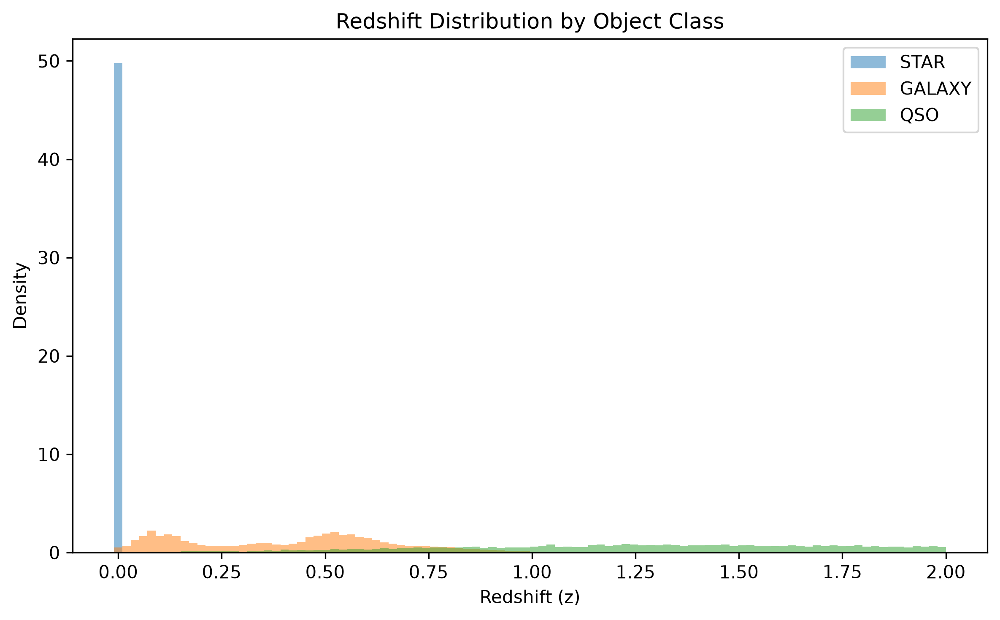
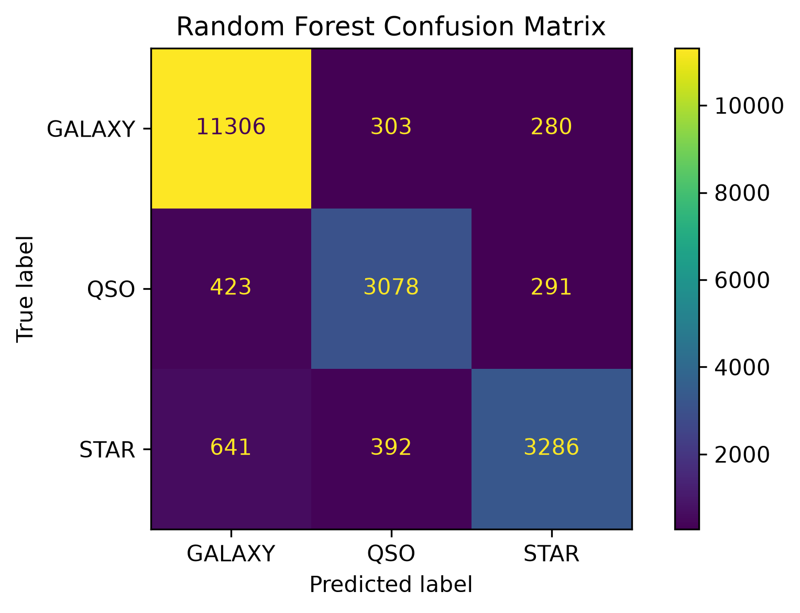
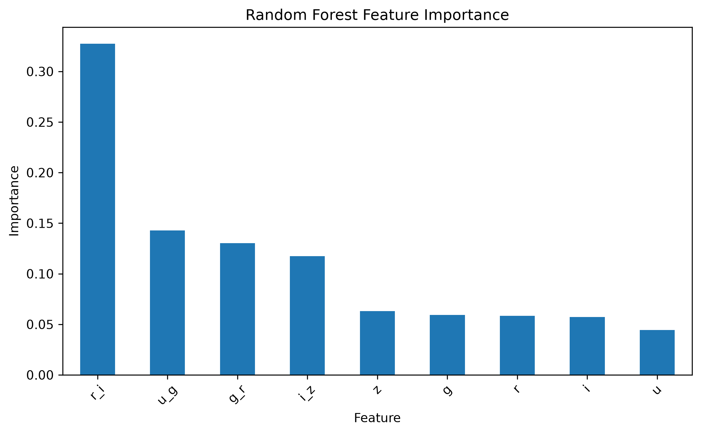
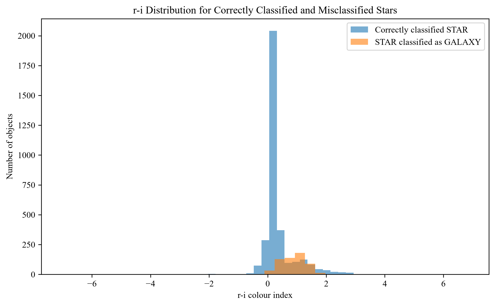

# SDSS Stellar Classification and Data Analysis

This project uses data from the Sloan Digital Sky Survey (SDSS) to investigate whether stars, galaxies and quasars (QSOs) can be distinguished using their photometric and spectroscopic properties.

I wanted to combine some of the programming and data analysis skills I've been developing with an astronomy problem, so the project includes exploratory analysis, SQL and machine learning.

## Results

I trained a Random Forest classifier using the SDSS photometric measurements and calculated colour indices.

The final model achieved:

* 88.39% accuracy on the test set
* 0.8505 macro F1 score
* 88.62% ± 0.27% accuracy using 5-fold cross-validation

The most important feature was the r-i colour index, with a feature importance of approximately 32.7%.

I also compared using magnitudes and colours separately:

| Features | Accuracy | Macro F1 |
| --- | ---: | ---: |
| Magnitudes only | 86.28% | 0.8242 |
| Colours only | 86.47% | 0.8269 |
| Magnitudes + colours | 88.35% | 0.8499 |

This suggests that the colour indices contain a lot of the information needed for classification, but combining them with the original magnitudes gives the best performance.

## Dataset

The dataset contains 100,000 astronomical objects classified as:

* Galaxy
* QSO (quasar)
* Star

The main measurements I used were the SDSS photometric magnitudes:

* u
* g
* r
* i
* z

The dataset also contains redshift, coordinates and other survey information.

The class distribution is:

| Class | Number | Percentage |
| --- | ---: | ---: |
| Galaxy | 59,445 | 59.45% |
| Star | 21,594 | 21.59% |
| QSO | 18,961 | 18.96% |



## Data Cleaning

The dataset uses -9999 to represent missing measurements. I identified these values and replaced them with missing values before carrying out the analysis.

I also calculated four photometric colour indices:

```text
u-g
g-r
r-i
i-z
```

These were then used alongside the original magnitudes in the later analysis.

## Exploratory Analysis

I started by looking at the distributions of the different photometric measurements and how they varied between the three object classes.

### Photometric colours

The colour distributions show noticeable differences between the classes.

Galaxies generally have larger colour indices, while QSOs tend to have smaller values. Stars tend to sit between the two for several of the colour indices.



I also plotted a colour-colour diagram to see how much the classes overlap.



The diagram shows some separation between the classes, but also significant overlap. This helps explain why colour can be useful for classification without being enough to perfectly separate the objects.

### Redshift

Redshift gives a much clearer distinction between the classes.

The median redshifts are approximately:

| Class | Median redshift |
| --- | ---: |
| Star | -0.0001 |
| Galaxy | 0.4563 |
| QSO | 1.6172 |

Stars are concentrated very close to zero redshift, while galaxies have larger redshifts and QSOs have substantially larger values.



I also found that around 79.6% of QSOs in the dataset have a redshift greater than 1, compared with around 1.5% of galaxies and 0% of stars.

## SQL Analysis

I loaded the cleaned data into a SQLite database and used SQL queries to investigate some of the same patterns.

The queries looked at:

* The number and percentage of each object class
* Mean redshift by class
* The number of high-redshift objects
* Mean colour indices

I included SQL in the project because I wanted to practise working with a database rather than doing the entire analysis directly in Pandas.

## Machine Learning

I used a Random Forest classifier to try to classify each object as a galaxy, QSO or star.

The model used:

```text
u, g, r, i, z
u-g, g-r, r-i, i-z
```

I used an 80/20 train-test split with stratification so that the class proportions were maintained.

### Classification performance

The Random Forest achieved 88.39% accuracy and a macro F1 score of 0.8505 on the test set.

| Class | Precision | Recall | F1 |
| --- | ---: | ---: | ---: |
| Galaxy | 0.92 | 0.95 | 0.93 |
| QSO | 0.82 | 0.80 | 0.81 |
| Star | 0.85 | 0.78 | 0.81 |



The model performs particularly well for galaxies. Stars and QSOs are harder to distinguish, which is consistent with the overlap seen in the colour-colour diagram.

### Comparing models

I also compared the Random Forest with Logistic Regression and an SVM using the same train-test split.

| Model | Accuracy | Macro F1 |
| --- | ---: | ---: |
| Logistic Regression | 75.77% | 0.6704 |
| SVM | 87.35% | 0.8358 |
| Random Forest | 88.39% | 0.8505 |

Logistic Regression performed substantially worse than the two non-linear models. This suggests that the relationship between the photometric features and object class is not well described by a simple linear decision boundary. The Random Forest gave the best overall performance, although the improvement over the SVM was relatively small.

### Feature importance

The Random Forest feature importance showed that the colour indices were particularly useful.

| Feature | Importance |
| --- | ---: |
| r-i | 32.7% |
| u-g | 14.3% |
| g-r | 13.0% |
| i-z | 11.7% |



The r-i colour index was by far the most important individual feature in this model.

### Magnitudes vs colours

I wanted to check whether the classifier was mainly using the original magnitudes or the colour information I had calculated.

I therefore trained three versions of the model:

1. Magnitudes only
2. Colour indices only
3. Magnitudes and colour indices together

The colour-only model actually performed slightly better than the magnitude-only model:

* Magnitudes: 86.28%
* Colours: 86.47%

However, combining both increased the accuracy to 88.35%.

This suggests that the colour indices and the original magnitudes contain some complementary information.

### Cross-validation

The 88.39% test accuracy comes from one particular train-test split, so I also used 5-fold stratified cross-validation to check how consistent the result was.

The five folds produced accuracies of:

```text
88.34%
88.46%
88.62%
88.52%
89.13%
```

giving a mean accuracy of:

88.62% ± 0.27%

The relatively small spread between the folds suggests that the model's performance is fairly stable.

### Error analysis

I also looked at the errors made by the Random Forest rather than only considering its overall accuracy.

There were 594 objects that were actually stars but were classified as galaxies. I compared these with the 3,348 stars that were classified correctly.

The mean colour indices were:

| Colour | Correctly classified STAR | STAR classified as GALAXY |
| --- | ---: | ---: |
| u-g | 1.570 | 1.664 |
| g-r | 0.634 | 1.333 |
| r-i | 0.364 | 0.866 |
| i-z | 0.185 | 0.475 |



The misclassified stars had noticeably larger colour indices, particularly g-r and r-i. This suggests that these stars occupy a region of photometric feature space that overlaps more with the galaxy population, making them harder for the classifier to distinguish.

The result is also consistent with the feature importance analysis: r-i was the most important feature in the Random Forest, and the stars misclassified as galaxies had a substantially larger mean r-i than the correctly classified stars.

## What I found

The main things I found from the analysis were:

* Redshift is a strong discriminator between stars, galaxies and QSOs.
* The three classes have noticeably different photometric colour distributions.
* There is still significant overlap between the classes in colour-colour space.
* Colour indices are useful for classification, with colour-only features slightly outperforming the raw magnitudes.
* Combining magnitudes and colours gives the best classification performance.
* r-i was the most important feature in the Random Forest model.
* Random Forest performed better than Logistic Regression and SVM on this dataset.
* The final classifier achieved approximately 88% accuracy, with stable performance across five cross-validation folds.
* The model's STAR-to-GALAXY errors were associated with higher colour indices, particularly g-r and r-i.

## Files

The main analysis is split between the notebooks, SQL, source code and figures folders.

The exploratory analysis is in `notebooks/01_data_exploration.py`.

The SQL queries are in `sql/01_basic_analysis.sql`.

The scripts in `src` contain the database setup, SQL analysis, Random Forest training, model comparison, feature comparison, confusion matrix, cross-validation and error analysis.

The `figures` folder contains the plots generated during the analysis.

## Tools

* Python
* Pandas
* Matplotlib
* Scikit-learn
* SQLite / SQL
* Git / GitHub

## Future Work

Some things I would like to explore further are:

* Looking more closely at why particular colour indices are useful
* Investigating additional SDSS features
* Seeing whether the classification accuracy can be improved while keeping the model interpretable
